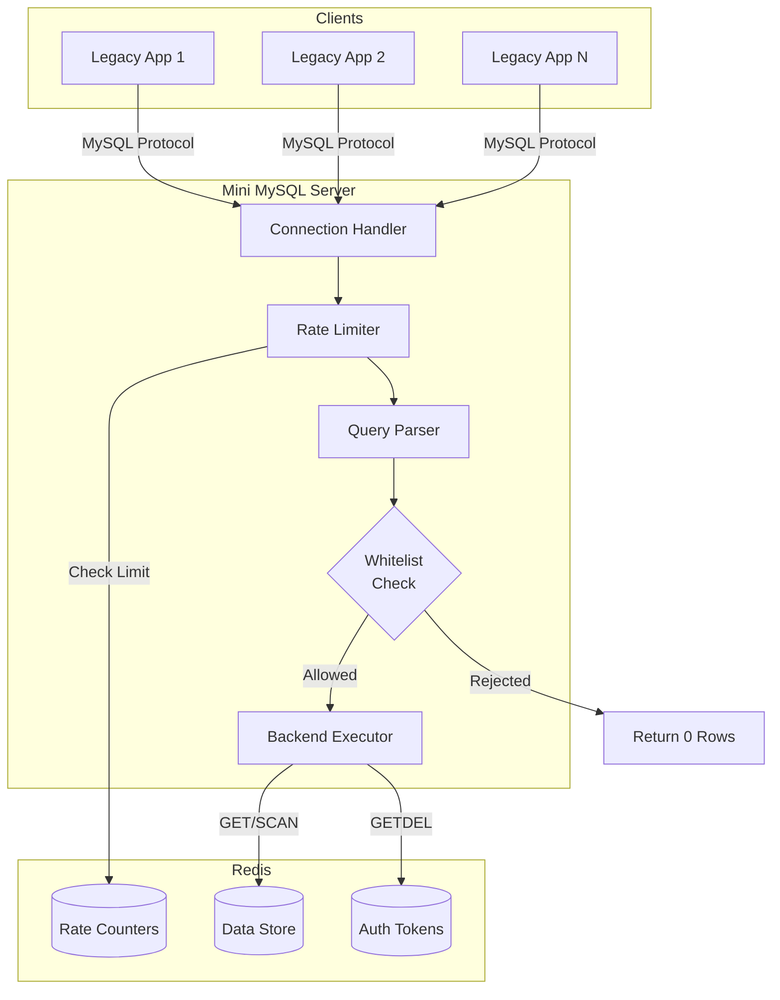
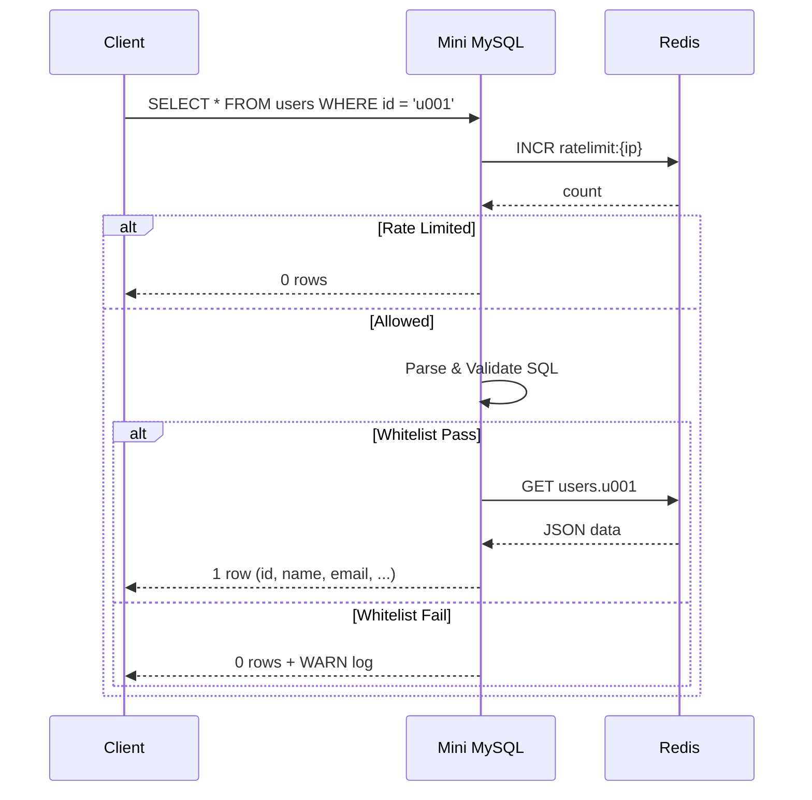
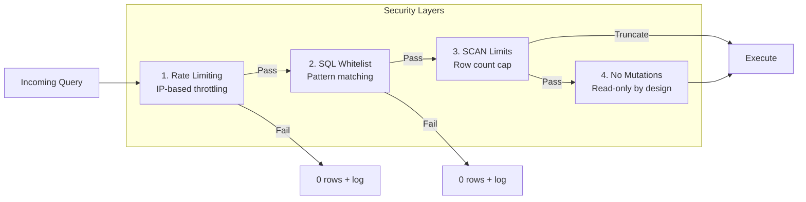

# Mini MySQL Server

A lightweight MySQL-compatible server that translates SQL queries to Redis operations. Designed as a **drop-in adapter** for legacy applications that speak MySQL but need to access Redis-backed data.

## Why?

```
┌─────────────────┐     MySQL Protocol     ┌──────────────────┐     Redis     ┌─────────┐
│  Legacy App     │ ───────────────────▶   │  Mini MySQL      │ ────────────▶ │  Redis  │
│  (MySQL Client) │                        │  Server          │               │         │
└─────────────────┘                        └──────────────────┘               └─────────┘
```

**Use Cases:**
- Bridge legacy systems to Redis-backed microservices
- QR code / token verification with atomic consumption
- Read-only data access with strict query restrictions
- Gradual migration from MySQL to Redis

## Features

| Feature | Description |
|---------|-------------|
| **Cross-Platform** | Works on Linux (Ubuntu) and Windows 11 |
| **MySQL 8 Compatible** | Works with any MySQL/MariaDB client |
| **SQL Whitelist** | Only allows safe, predefined query patterns |
| **Rate Limiting** | IP-based throttling via Redis |
| **SCAN Protection** | Configurable limits on full table scans |
| **Token Verification** | `qr_verify()` function with atomic consumption |
| **Graceful Degradation** | Returns empty results on Redis failure |
| **Structured Logging** | Query type, duration, client IP, result |

## Architecture



## Query Flow



## Supported SQL

### Allowed Queries

| Query Pattern | Redis Operation | Example |
|--------------|-----------------|---------|
| `SELECT @@version` | - | Version info |
| `SHOW TABLES` | - | List tables |
| `DESC {table}` | - | Table schema |
| `SELECT * FROM {table} WHERE {pk} = '{value}'` | `GET {table}.{value}` | PK lookup |
| `SELECT * FROM {table}` | `SCAN {table}.*` | Full scan (limited) |
| `SELECT qr_verify('{token}')` | `GETDEL auth:{token}` | Token verification |
| `SET ...` / `USE ...` | - | Ignored (OK response) |

### Rejected Queries (Return 0 Rows)

```sql
-- Complex WHERE clauses
SELECT * FROM users WHERE id = 'u001' AND name = 'Alice';  -- AND
SELECT * FROM users WHERE age > 20;                        -- Comparison
SELECT * FROM users WHERE name LIKE 'A%';                  -- LIKE
SELECT * FROM users WHERE id IN ('u001', 'u002');          -- IN

-- JOINs and aggregations
SELECT * FROM users JOIN orders ON ...;                    -- JOIN
SELECT * FROM users ORDER BY name;                         -- ORDER BY
SELECT * FROM users GROUP BY age;                          -- GROUP BY
SELECT * FROM users LIMIT 10;                              -- LIMIT

-- Mutations
INSERT INTO users VALUES (...);
UPDATE users SET name = 'X' WHERE id = 'u001';
DELETE FROM users WHERE id = 'u001';
```

## Data Model

### Redis Key Structure

```
{table}.{primary_key} → JSON value

Example:
  users.u001 → {"name":"Alice","email":"alice@example.com","age":30,"created_at":"2024-01-15 10:00:00"}
  users.u002 → {"name":"Bob","email":"bob@example.com","age":25,"created_at":"2024-01-15 11:00:00"}
```

### Auth Token Structure

```
auth:{token} → JSON value (with TTL)

Example:
  auth:abc123 → {"user_id":"u001","facility":"fac-tokyo"} TTL=30s
```

### qr_verify() Response

```sql
SELECT qr_verify('abc123');

-- First call (token exists):
+----------+---------+-----------+---------------------+------+
| verified | user_id | facility  | verified_at         | data |
+----------+---------+-----------+---------------------+------+
| 1        | u001    | fac-tokyo | 2024-01-15 10:30:00 |      |
+----------+---------+-----------+---------------------+------+

-- Second call (token consumed):
Empty set (0 rows)
```

## Installation

### Prerequisites

- Rust 1.70+
- Redis 6.0+

### Supported Platforms

| Platform | Status | Notes |
|----------|--------|-------|
| Linux (Ubuntu) | Tested | systemd service file included |
| Windows 11 | Tested | Use NSSM for service registration |

### Build

```bash
git clone https://github.com/yourname/mini-mysql-server.git
cd mini-mysql-server
cargo build --release
```

### Run

```bash
./target/release/mini-mysql-server \
  -p 13306 \
  -r redis://127.0.0.1:6379 \
  --scan-limit 100 \
  --rate-limit 100 \
  --rate-window 60
```

### Windows Service (NSSM)

```powershell
# Install NSSM
winget install nssm

# Register as Windows service
nssm install mini-mysql "C:\path\to\mini-mysql-server.exe"
nssm set mini-mysql AppDirectory "C:\path\to"
nssm set mini-mysql AppParameters "-p 13306 -r redis://127.0.0.1:6379"

# Start service
nssm start mini-mysql
```

## Configuration

| Flag | Env Var | Default | Description |
|------|---------|---------|-------------|
| `-p, --port` | - | `3306` | MySQL listen port |
| `-r, --redis-url` | - | `redis://127.0.0.1:6379` | Redis connection URL |
| `--scan-limit` | - | `100` | Max rows for SCAN (0 = disabled) |
| `--rate-limit` | - | `100` | Max requests per IP per window |
| `--rate-window` | - | `60` | Rate limit window in seconds |
| `--allow-scan` | - | `true` | Allow full table scans |
| `--log-level` | - | `info` | Log level (trace/debug/info/warn/error) |

## Docker Compose

```yaml
services:
  mini-mysql:
    build: .
    ports:
      - "13306:3306"
    environment:
      - RUST_LOG=info
    command: >
      mini-mysql-server
      -p 3306
      -r redis://redis:6379
      --scan-limit 100
      --rate-limit 100
    depends_on:
      - redis

  redis:
    image: redis:7-alpine
    volumes:
      - redis-data:/data

volumes:
  redis-data:
```

## Usage Examples

### Basic Queries

```bash
# Connect
mysql -h 127.0.0.1 -P 13306

# Check version
SELECT @@version;
# → 8.0.36-mini-mysql-redis

# List tables
SHOW TABLES;
# → users

# Describe table
DESC users;
# → Field, Type, Key

# Primary key lookup
SELECT * FROM users WHERE id = 'u001';
# → 1 row
```

### Token Verification

```bash
# Set token in Redis (TTL 30 seconds)
redis-cli SET "auth:abc123" '{"user_id":"u001","facility":"fac-tokyo"}' EX 30

# Verify (consumes token)
mysql -h 127.0.0.1 -P 13306 -e "SELECT qr_verify('abc123');"
# → verified=1, user_id=u001, facility=fac-tokyo

# Second attempt (token gone)
mysql -h 127.0.0.1 -P 13306 -e "SELECT qr_verify('abc123');"
# → Empty set
```

### Seed Test Data

```bash
redis-cli SET "users.u001" '{"name":"Alice","email":"alice@example.com","age":30,"created_at":"2024-01-15 10:00:00"}'
redis-cli SET "users.u002" '{"name":"Bob","email":"bob@example.com","age":25,"created_at":"2024-01-15 11:00:00"}'
```

## Security Model



### Design Principles

1. **Whitelist, not blacklist** - Only explicitly allowed queries execute
2. **Fail silently** - Invalid queries return 0 rows (no errors to leak info)
3. **Limit everything** - Rate limits, scan limits, no unbounded operations
4. **No mutations** - INSERT/UPDATE/DELETE always rejected
5. **Atomic operations** - Token verification uses GETDEL (no race conditions)

## Failure Modes

| Scenario | Behavior |
|----------|----------|
| Redis down at startup | Exit with code 1 |
| Redis down during query | Return 0 rows, log ERROR |
| Rate limit exceeded | Return 0 rows, log WARN |
| Invalid SQL | Return 0 rows, log WARN |
| Unknown table | Return 0 rows |

## Logging

Structured log format with key fields:

```
INFO  query_executed query_type="pk_lookup" table="users" duration_ms=2 rows=1 client=192.168.1.10 result="success"
WARN  query_rejected query_type="rejected" client=192.168.1.10 result="rejected"
WARN  scan_operation_triggered table="users" limit=100 client=192.168.1.10
WARN  rate_limit_exceeded ip=192.168.1.10 count=101 limit=100
ERROR redis_connection_error operation="get" error="Connection refused"
```

## Project Structure

```
src/
├── main.rs          # Entry point, server loop
├── config.rs        # CLI argument parsing
├── backend.rs       # AsyncMysqlShim implementation
├── query.rs         # SQL parsing and validation
├── rate_limit.rs    # IP-based rate limiting
├── auth.rs          # qr_verify() implementation
└── logging.rs       # Structured logging utilities
```

## Roadmap

- [x] Phase 1: Core infrastructure (config, logging, Redis failure handling)
- [x] Phase 2: SQL whitelist and SCAN control
- [x] Phase 3: Rate limiting
- [x] Phase 4: Token verification (qr_verify)
- [ ] Phase 5: Multiple table support (dynamic schema)
- [ ] Phase 6: Metrics endpoint (Prometheus)
- [ ] Phase 7: TLS support

## License

MIT

## Contributing

Contributions welcome! Please read the design principles above before submitting PRs.

---

Built with [opensrv-mysql](https://github.com/datafuselabs/opensrv) and Redis.
